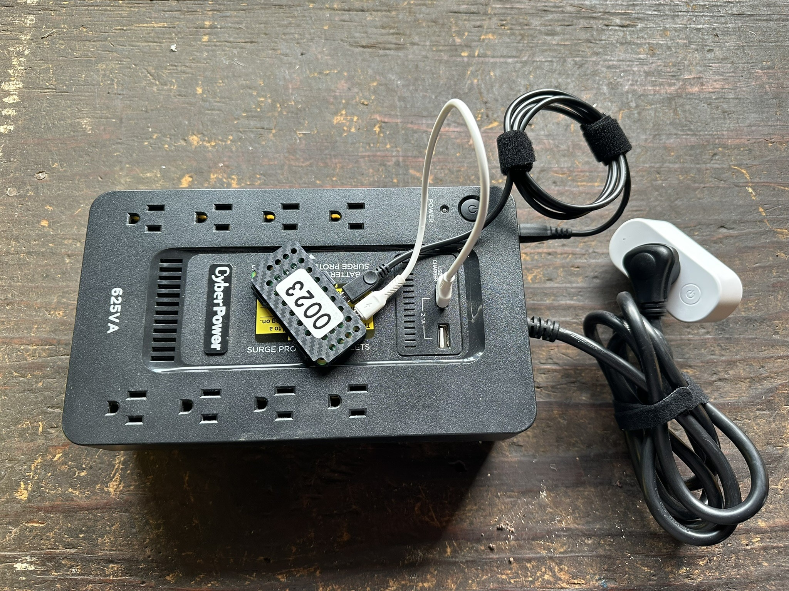

# Smart UPS
Using a Raspberry Pi to add smarts to a standard UPS with a USB interface

## In Progress
Video is finished, just need to finish this github and upload!

## Bill of Materials

|	Description	                                                      | Link                                  | Cost    |
|-------------------------------------------------------------------|---------------------------------------|---------|
| Raspberry Pi Zero 2 W                                             | https://www.amazon.com/dp/B09LH5SBPS  |  $29.99 |
| Compact Raspberry Pi Zero Case                                    | https://www.amazon.com/dp/B0CXWFX783  |  $4.99  |
| Micro USB to USB B Cable (2 Pack)                                 | https://www.amazon.com/dp/B099N1PWW6  |  $9.99  |
| USB A to Micro USB Cable (5 Pack)                                 | https://www.amazon.com/dp/B095JZSHXQ  |  $6.99  |
| 32GB Micro SD Card                                                | https://www.amazon.com/dp/B0C1Y87VT3  |  $9.99  |
| Shelly Smart Plug                                                 | https://www.amazon.com/dp/B096W3ZZDD  |  $23.00 |
| SD Card Reader                                                    | https://www.amazon.com/dp/B081VHSB2V  |  $9.99  |

## Links and Resources

[Raspberry Pi Imager](https://www.raspberrypi.com/software/)

[PuTTY](https://www.chiark.greenend.org.uk/~sgtatham/putty/latest.html)

[Network UPS Tools](https://networkupstools.org/)

[Home Assistant](https://home-assistant.io)
